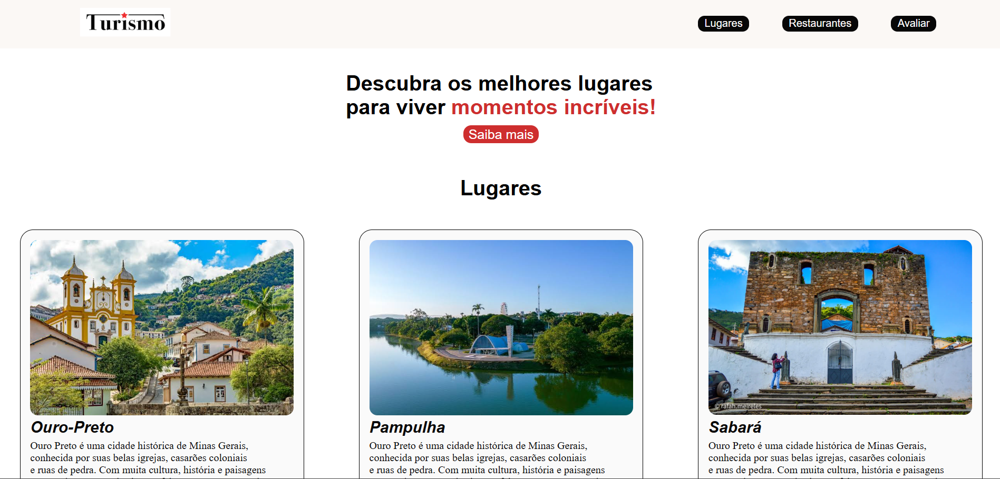

# atividade-semana4
# Momentos & Destinos

## Dados do Aluno

Nome: Priscilla Eduarda G. Costa
Matrícula: 929102
Proposta do projeto: Site de turismo e experiências
Descrição: O projeto Turismo é um site desenvolvido para apresentar lugares turísticos, restaurantes e experiências. O objetivo é ajudar os usuários a descobrir novos destinos e compartilhar avaliações.

## Wireframe do Projeto

## Home Page

